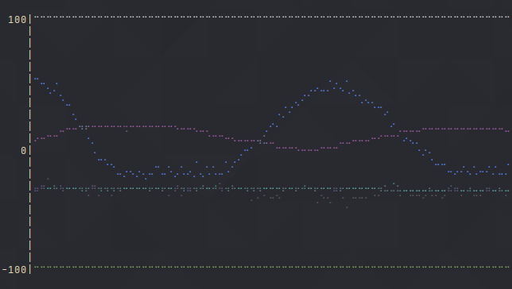

# Plotter

Simple little tool which does what it says on the tin, it plots stuff. If you
have a program which writes out lines of numbers and you want to draw these
values in a nice plot then this is the tool for you! The tool will read from
standard input and write out a nice plot scrolling left to right. The plot is
drawn using the Unicode Braille characters, and each column of values is given
a colour chosen from your X resources (your terminal colours). Values in the
input can be separated by either whitespace, a comma, or both. The plot also
scales to fill your entire terminal, and shows you the lowest and highest value
of your data.

The above image was gotten from running a program which received data from an
Arduino reading some analog data. The program running on the Arduino writes out
four values along with the numbers `100,-100` to clamp the graph.
